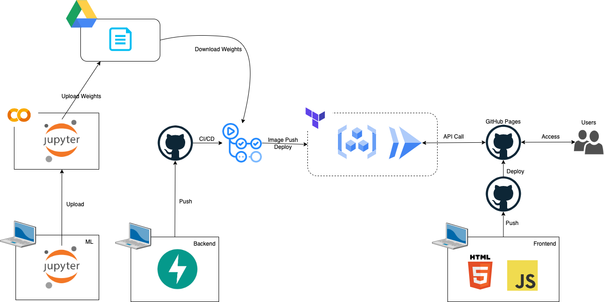

# seminar-2022
字幕システム改良PJのまとめ（情報工学ゼミ2022 [村田研究室]）

## Links
- [service](https://murata-laboratory.github.io/seminar-2022-frontend/)
  - You can try our service here.
  - Development is still in progress, so it may not work properly.
- [presentation slide](./presentation.pdf)

## Architecture

## Repositories
### Frontend
https://github.com/MURATA-Laboratory/seminar-2022-frontend
- speech recognition
- html
- js

### Backend
https://github.com/MURATA-Laboratory/seminar-2022-backend
- FastAPI
- docker & docker-compose
- terraform
- github actions
- cloud run

### LF, Comma, Period Model
https://github.com/MURATA-Laboratory/seminar-2022-newline-model
- pytorch & pytorch-lightning
- wandb

### Summary Model
https://github.com/MURATA-Laboratory/seminar-2022-summary-model
- pytorch & pytorch-lightning
- wandb
